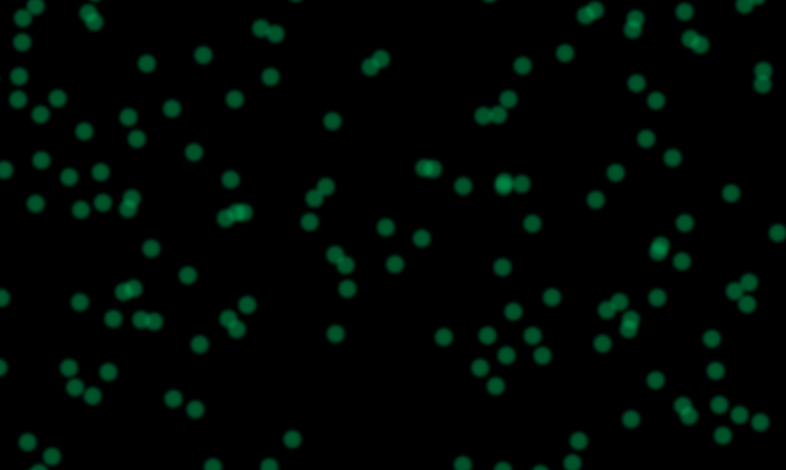

 
     

# Particle System OpenGL

Contains a particle system abstraction on top of the previous OpenGL boilerplate code (`07-boilerplate`). 

Each particle system is supposed (although not necessary) to have 1 renderer fully for itself. 
Meaning that all the particles will be batched into 1 draw call.
